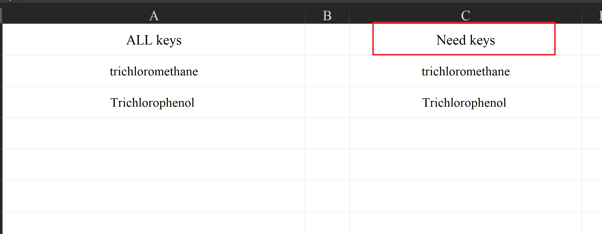
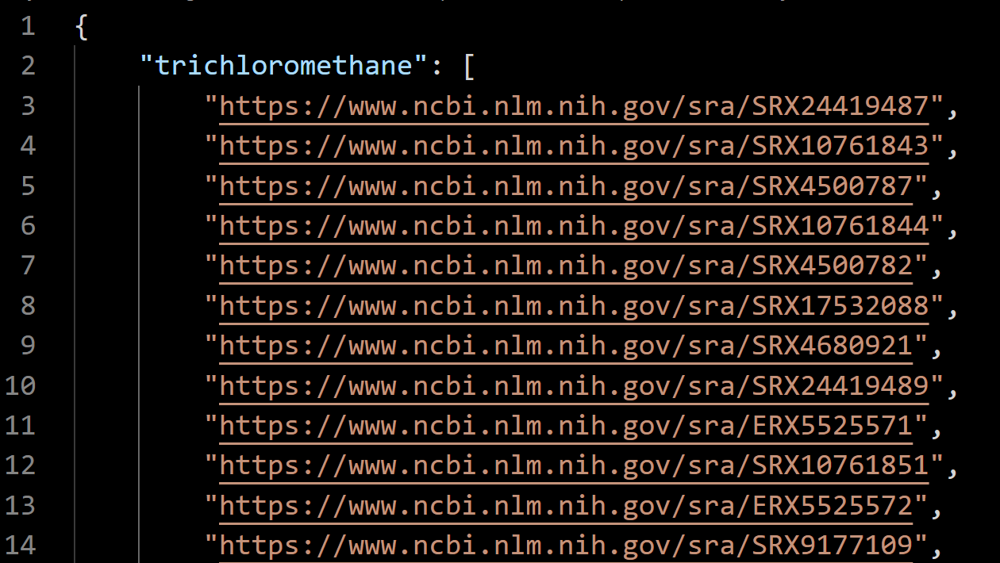
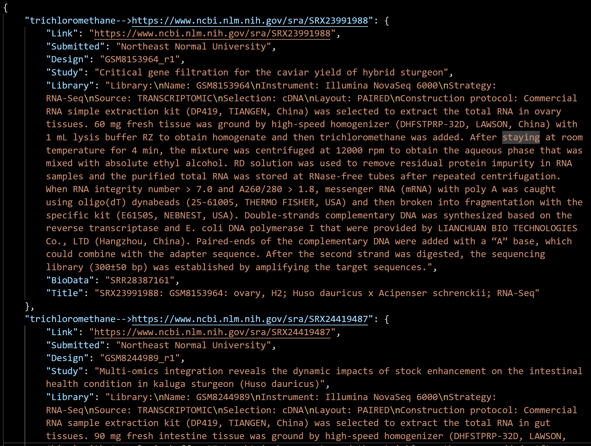
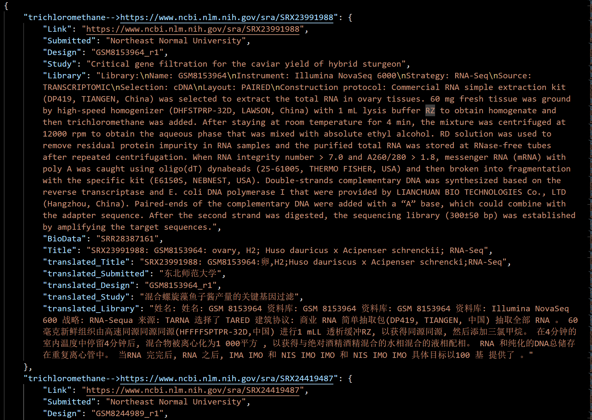
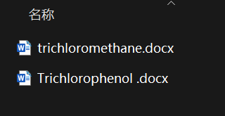

# 1. 说明

通过关键词查找 NCBI 中的 SRA 数据

# 2. 使用方法

## 2.1. main_1.py

main_1.py 使用 Keys_ALL.xlsx 中 Need keys 列的数据，在这里填入需要搜索的关键词：



启动 main_1.py，结束后会在 ```\Data\Data_temp\``` 下生成 ```Link_results.json``` 文件，存放各个关键词的待搜索链接：



## 2.2. main_2.py

main_2.py 使用 ```Link_results.json``` 的数据，结束后会在 ```\Data\Data_temp\``` 下生成 ```DeepData_results.json``` 文件，
存放各个搜索链接得到的信息，以形如 ```trichloromethane-->https://www.ncbi.nlm.nih.gov/sra/SRX23991988``` 的格式保存：


## 2.3. main_3.py

运行 main_3.py 以调用 transformers 的预训练的本地翻译库进行翻译，
翻译质量可能逊色与谷歌翻译，但是没有网络错误的问题需要担忧。结束后会在 ```\Data\Data_temp\``` 下生成 ```Translated_results.json``` 文件，
存放基于 ```DeepData_results.json``` 的翻译信息：



## 2.4. main_4.py

将 ```Translated_results.json``` 的数据写入到 Word 中方便查看，存放在 ```\Data\Data_fin\``` 下，并以各个关键词分开文档：



## 2.5. Test

在代码中，令 Test=1，用于测试或开发使用，以额外后缀名```_test``` 进行保存。

# 3. 运行全套流程的控制台输出示例!

```
D:\hty\ins\Anaconda\envs\p39\python.exe "D:/hty/ins/PyCharm_2024/PyCharm 2024.2.2/plugins/python-ce/helpers/pydev/pydevconsole.py" --mode=client --host=127.0.0.1 --port=52657 
import sys; print('Python %s on %s' % (sys.version, sys.platform))
sys.path.extend(['D:\\hty\\creat\\code\\github\\NCBI-SRA-Search-script'])
PyDev console: starting.
Python 3.9.18 (main, Sep 11 2023, 13:30:38) [MSC v.1916 64 bit (AMD64)] on win32
runfile('D:\\hty\\creat\\code\\github\\NCBI-SRA-Search-script\\PY\\Main.py', wdir='D:\\hty\\creat\\code\\github\\NCBI-SRA-Search-script\\PY')
初始化 WebDriver 中
初始化 WebDriver 完成
trichloromethane: 1/5 页
trichloromethane: 2/5 页
trichloromethane: 3/5 页
trichloromethane: 4/5 页
trichloromethane: 5/5 页
trichloromethane 共 100 个数据
1/2 - trichloromethane 完成
Trichlorophenol  共 9 个数据
2/2 - Trichlorophenol  完成
数据更新到 D:\hty\creat\code\github\NCBI-SRA-Search-script\Data\Data_temp\Link_results.json
初始化 WebDriver 中
初始化 WebDriver 完成
开始搜寻
1/109 - trichloromethane-->https://www.ncbi.nlm.nih.gov/sra/SRX23991988 完成
2/109 - trichloromethane-->https://www.ncbi.nlm.nih.gov/sra/SRX24419487 完成
3/109 - trichloromethane-->https://www.ncbi.nlm.nih.gov/sra/ERX5525572 完成
4/109 - trichloromethane-->https://www.ncbi.nlm.nih.gov/sra/SRX17532088 完成
........................
107/109 - Trichlorophenol -->https://www.ncbi.nlm.nih.gov/sra/SRX24052305 完成
108/109 - Trichlorophenol -->https://www.ncbi.nlm.nih.gov/sra/SRX24052291 完成
109/109 - Trichlorophenol -->https://www.ncbi.nlm.nih.gov/sra/SRX24052131 完成
数据更新到 D:\hty\creat\code\github\NCBI-SRA-Search-script\Data\Data_temp\DeepData_results.json
2024-11-06 14:38:10.819762: I tensorflow/core/util/port.cc:153] oneDNN custom operations are on. You may see slightly different numerical results due to floating-point round-off errors from different computation orders. To turn them off, set the environment variable `TF_ENABLE_ONEDNN_OPTS=0`.
2024-11-06 14:38:12.562360: I tensorflow/core/util/port.cc:153] oneDNN custom operations are on. You may see slightly different numerical results due to floating-point round-off errors from different computation orders. To turn them off, set the environment variable `TF_ENABLE_ONEDNN_OPTS=0`.
翻译进度 1/109 - SRX10761843: 16S rDNA V4 region sequencing of mus musculus: adult male cecum content
翻译进度 2/109 - SRX17532088: GSM6573333: KO1; Mus musculus; RNA-Seq
翻译进度 3/109 - SRX4500787: RNA-seq of Bombyx mori: male fat body
翻译进度 4/109 - SRX9177118: GSM4799944: inactive_ALKBH5_dox_minus_ip1; Homo sapiens; OTHER
........................
翻译进度 103/109 - SRX24052631: GSM8168232: Plate13_C17; Homo sapiens; RNA-Seq
翻译进度 104/109 - SRX24052501: GSM8168426: Plate13_K17; Homo sapiens; RNA-Seq
翻译进度 105/109 - SRX6432723: GSM3938242: CL; Musa acuminata AAA Group; RNA-Seq
翻译进度 106/109 - SRX24052655: GSM8168304: Plate13_G17; Homo sapiens; RNA-Seq
翻译进度 107/109 - SRX24052291: GSM8168326: Plate13_F17; Homo sapiens; RNA-Seq
翻译进度 108/109 - SRX24052305: GSM8168376: Plate13_J17; Homo sapiens; RNA-Seq
翻译进度 109/109 - SRX24052131: GSM8168250: Plate13_D17; Homo sapiens; RNA-Seq
数据更新到 D:\hty\creat\code\github\NCBI-SRA-Search-script\Data\Data_temp\Translated_results.json
进度 1/2 - Trichlorophenol 
已保存到 D:\hty\creat\code\github\NCBI-SRA-Search-script\Data\Data_fin\Trichlorophenol .docx
进度 2/2 - trichloromethane
已保存到 D:\hty\creat\code\github\NCBI-SRA-Search-script\Data\Data_fin\trichloromethane.docx

```